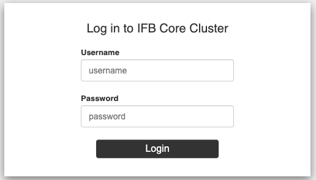
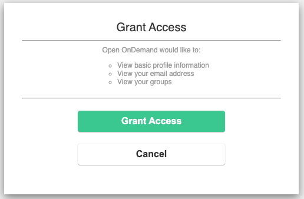
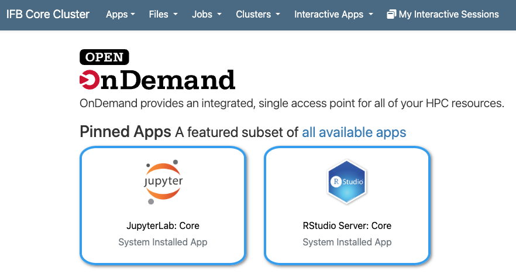
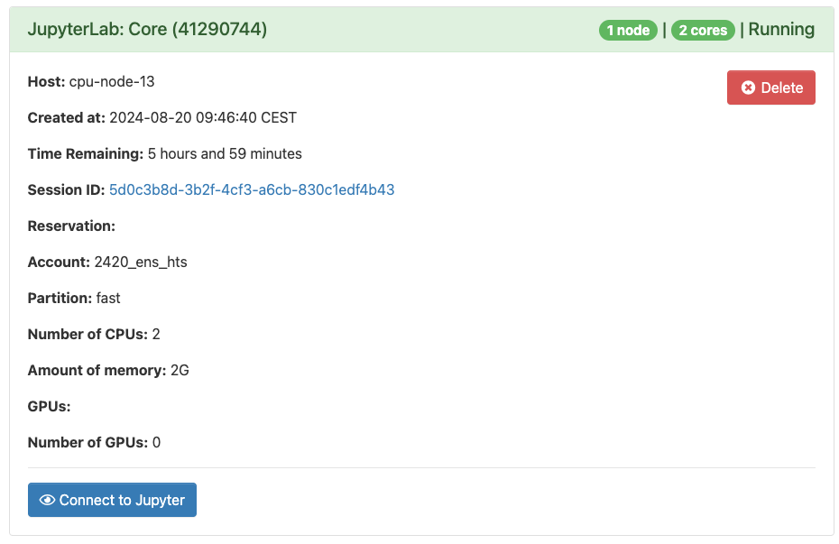
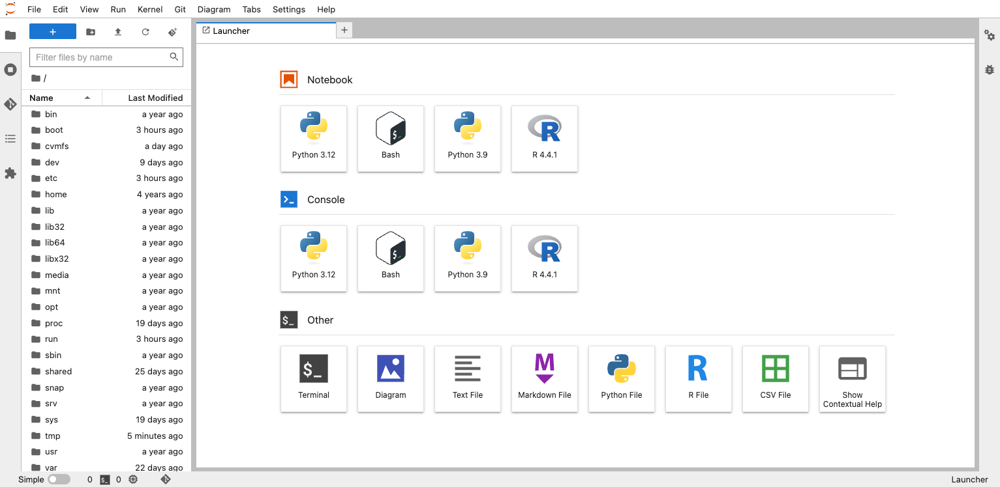
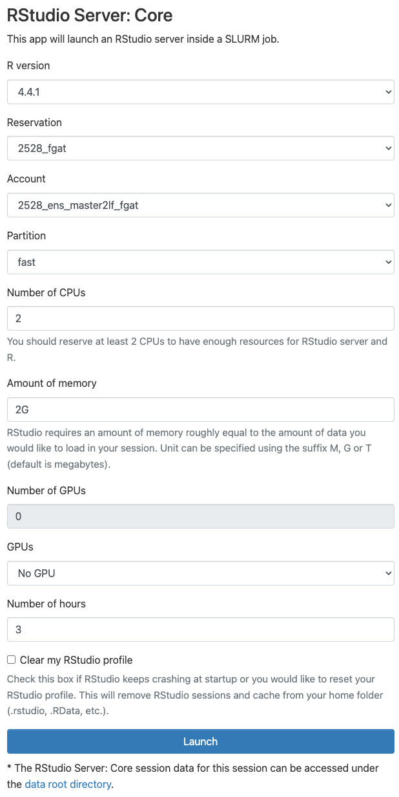
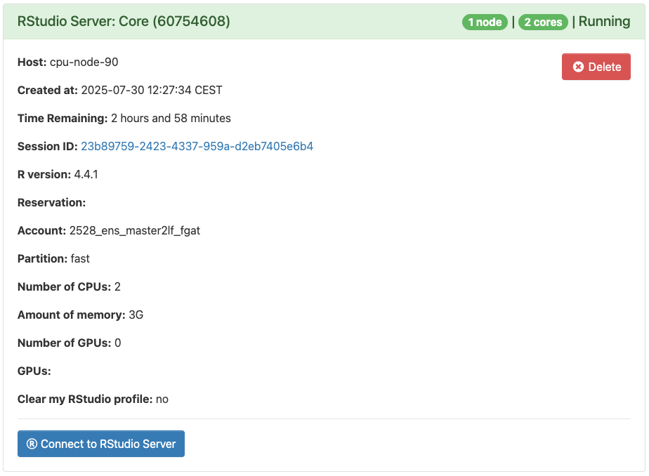
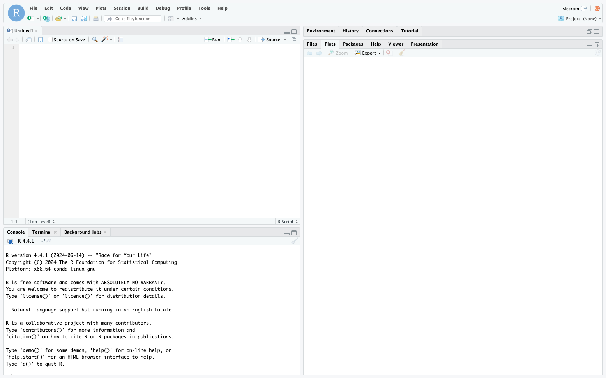

# How to work with the IFB cluster

You're going to use [Open OnDemand](https://ifb-elixirfr.gitlab.io/cluster/doc/software/openondemand/), a browser-based portal to all resources within the IFB cluster.

***

## Sign in on IFB cluster Open OnDemand

In a web browser, connect to [https://ondemand.cluster.france-bioinformatique.fr//](https://ondemand.cluster.france-bioinformatique.fr//) and log in using your IFB username and password.

Clic on the "Grant Access" button.

Bookmark this URL in your browser for easy retrieval.

***

## Using a JupyterLab session to access Unix terminal

Clic on the "JupyterLab" tile

### Select your server options

On the following screen you can select the option used by our JupyterHub server during the practical. Two nodes have been booked for our training session on IFB server. To build your server on these nodes select the following options:

* Reservation: 2528_fgat
* Account: 2528_ens_master2lf_fgat
* Partition: fast
* CPU: 2
* Memory: 2G
* GPUs: No GPU
* Number of hours: 3

Clic on "Launch" and wait for the JupyterLab session to be created. Once running, clic on "Connect to Jupyter" to access the server.

***

### Start a terminal session

Once your server has been launched, you will be taken to the application launcher page.

You can click on the "Terminal" tile in order to open a terminal window.

***

## Using an Rstudio environment

Clic on the "RStudio Server" tile

### Select your server options

On the following screen you can select the option used by our RStudio server during the practical. Two nodes have been booked for our training session on IFB server. To build your server on these nodes select the following options:

* Reservation: 2528_fgat
* Account: 2528_ens_master2lf_fgat
* Partition: fast
* CPU: 2
* Memory: 3G
* GPUs: No GPU
* Number of hours: 3

Clic on "Launch" and wait for the RStudio session to be created. Once running, clic on "Connect to RStudio Server" to access the server.

***

You can get more information using the [IFB-core Cluster documentation](https://ifb-elixirfr.gitlab.io/cluster/doc/) and the [dedicated Open On Demand pages](https://ifb-elixirfr.gitlab.io/cluster/doc/software/openondemand/). 
