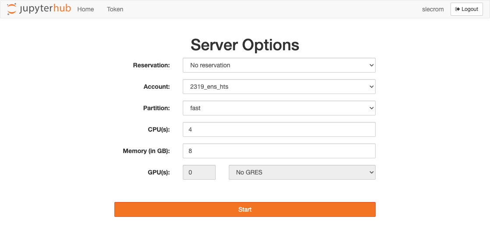
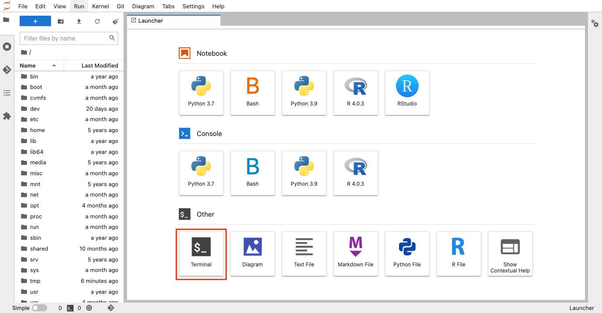
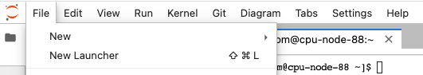
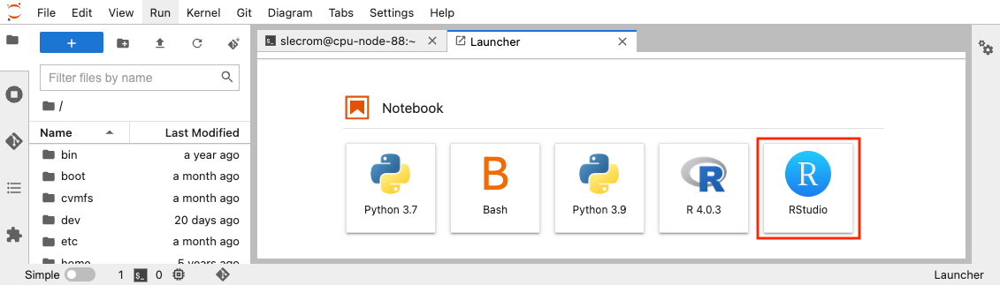
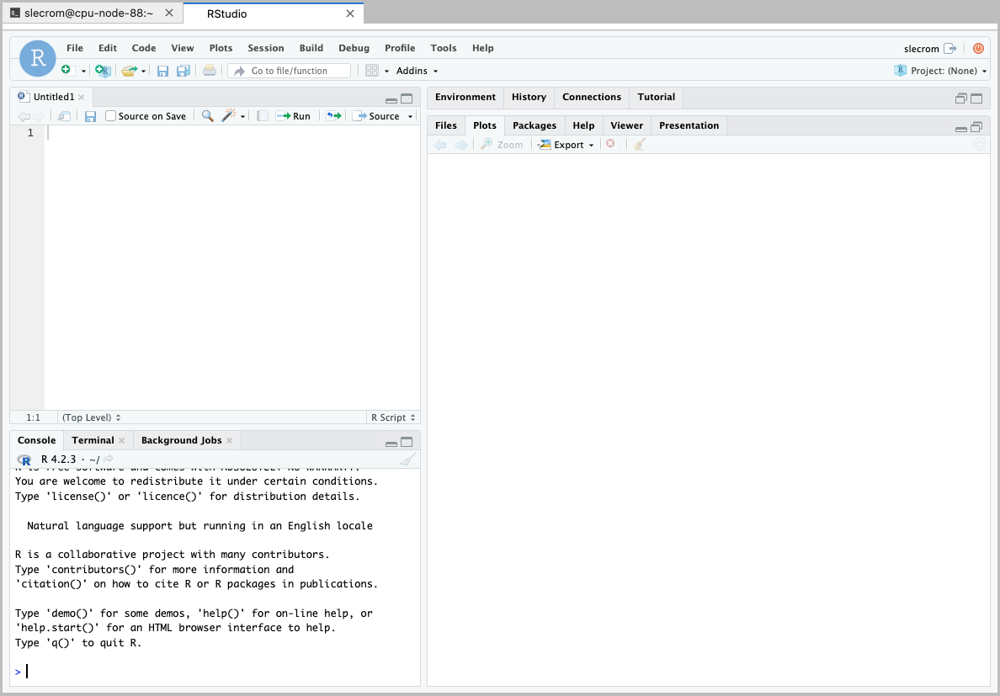

# How to work with the IFB cluster

You're going to use JupyterHub, a web application that lets you create JupyterLab servers on the IFB cluster.

***

## Sign in on IFB cluster JupyterHub

In a web browser, connect to [https://jupyterhub.cluster.france-bioinformatique.fr/](https://jupyterhub.cluster.france-bioinformatique.fr/) and log in using your IFB username and password.

Bookmark this URL in your browser for easy retrieval.

***

## Select your server options

On the following screen you can select the option used by our JupyterHub server during the practical.

***

## Start a terminal session

Once your server has been launched, you will be taken to the application launcher page.

You can click on the "Terminal" tile in order to open a terminal window.

***

## Launching an Rstudio environment

In the JupyterHub interface select "New launcher" in the "File" drop-down menu.

Click on "Rstudio" to start a new session.

***

You can get more information using the [IFB-core Cluster documentation](https://ifb-elixirfr.gitlab.io/cluster/doc/). 
