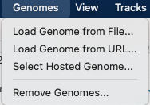
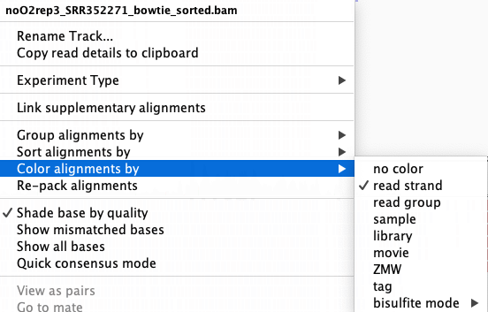

# Practical 2: Analysis of RNA-seq data

1. [Introduction](#introduction)
2. [Set up your working environment](#set-up-your-working-environment)
3. [Sequence quality controls](#sequence-quality-controls)
4. [Mapping of reads on the reference genome](#mapping-of-reads-on-the-reference-genome)
5. [Post-processing of alignment files](#post-processing-of-alignment-files)
6. [Alignments visualization using a genome browser](#alignments-visualization-using-a-genome-browser)
7. [Gene counts estimation](#gene-counts-estimation)
8. [Search for differentially expressed genes](#search-for-differentially-expressed-genes)

&nbsp;

## Introduction

### Objective of this practical session

During this practical session, you will learn:
  * To conduct an analysis of RNA-seq raw fastq files. You will first perform **quality control** of the sequencer file outputs before proceding to the **mapping** of the reads onto the reference genome.
  * To perform statistical analysis of the gene expression matrices in order to identify differentialy expressed genes between two conditions.

### Dataset

Data used in these practical were collected from the following publication: Guida, A., Lindstädt, C., Maguire, S. L., Ding, C., Higgins, D. G., Corton, N. J., Berriman, M., et al. (2011). Using RNA-seq to determine the transcriptional landscape and the hypoxic response of the pathogenic yeast *Candida parapsilosis*. [Guida *et al*. BMC Genomics 2011](https://bmcgenomics.biomedcentral.com/articles/10.1186/1471-2164-12-628)

The raw sequencing files located into the projet data folder of the IFB-core Cluster : /shared/projects/form_2022_23/ where retrieved from the [EBI European Electronic Archive](https://www.ebi.ac.uk/ena/browser/home) using the study accession number [PRJNA154483](https://www.ebi.ac.uk/ena/browser/view/PRJNA154483).

&nbsp;

## Set up your working environment

1. Connect to the IFB-core server. Look at the [tutorial](../IFBserver.md) to see how to proceed. You can also look at the [useful commands to work on the IFB-core Cluster](../IFBcommands.md) page.

2. Go to your home directory

	```bash
	cd 
	```

3. Create a directory that will contain all results of the upcoming analyses

	```bash
	mkdir RNAseq
	```

4. Go to the newly created directory

	```bash
	cd RNAseq
	```

5. Check your are in the right directory using the `pwd` command:

	```bash
	pwd
	/shared/home/<your login>/RNAseq
	```

&nbsp;

## Sequence quality controls

**Fastq** files are raw results from RNA-seq experiments. These files comprise all the **sequences** (or reads) obtained from the sequencer device (Illumina technology in this practical), together with **base quality scores** (PHRED scores).

Two different files will be analyzed during this practical from Guida *et al.* publication:
- ***O2rep2_SRR352263.fastq*** refereed to a transcriptome analysis of yeasts *C. parapsilosis* under normoxic condition ([ENA access number: SRR352263](https://www.ebi.ac.uk/ena/browser/view/SRR352263))
- ***noO2rep3_SRR352271.fastq*** refereed to a transcriptome analysis of yeasts *C. parapsilosis* under hypoxic condition ([ENA access number: SRR352271](https://www.ebi.ac.uk/ena/browser/view/SRR352271))

In a first step, controls will be performed on each FASTQ files in order to evaluate the overall quality of the sequences and identify potential problems that could impact the following analyses. During this practical we will use the [**FastQC**](http://www.bioinformatics.babraham.ac.uk/projects/fastqc/) software solution.

FastQC is a quality control application for high throughput sequence data. It provides an interactive application to review the results of several different quality control checks, and create an **HTML based report**. The main functions of FastQC are:
- **Import of data** from BAM, SAM or FastQ files (any variant)
- Providing a **quick overview** to tell you in which areas there may be problems
- **Summary graphs** and tables to quickly assess your data
- Export of results to an **HTML based report**
- **Offline operation mode** to allow automated generation of reports without running the interactive application

> ***
>
> **What you have to do:** 
> - [ ] &nbsp; Use FASTQC to evaluate the quality of sequences in each FASTQ files. Using information from the [Fastqc help page](http://www.bioinformatics.babraham.ac.uk/projects/fastqc/Help) as well as exemples of [good](http://www.bioinformatics.babraham.ac.uk/projects/fastqc/good_sequence_short_fastqc.html) or  [bad](http://www.bioinformatics.babraham.ac.uk/projects/fastqc/bad_sequence_fastqc.html) illumina data as references.
> - [ ] &nbsp; Compare results between the two FASTQ files. Is there any concern related to the following analyses?
>
> ***

1. Create a new directory to store the output of fastqc

	```bash
	mkdir 1-QC
	# Using the `tree` command, your directory should look like this:
	tree
	│
	└───1-QC
	```

2. Go to this directory

	```bash
	cd 1-QC
	```

3. Make fastqc available in your environment

	```bash
	module load fastqc/0.11.9
	```

4. Check the help page of the programme to see its usage and parameters 

	```bash
	srun fastqc --help
	```

5. Run fastqc on each experiment files

	```bash
	# O2 condition
	# Absolute path to the file: /shared/projects/form_2022_23/data/rnaseq/O2rep2_SRR352263.fastq
	# -o option creates all output files in the specified output directory, '.' means current directory

	srun fastqc /shared/projects/form_2022_23/data/rnaseq/O2rep2_SRR352263.fastq -o .

	# noO2 condition
	srun fastqc /shared/projects/form_2022_23/data/rnaseq/noO2rep3_SRR352271.fastq -o .
	```

	At this point you should see the new files in your directory using the `tree` command

	```bash
	tree
	│
	└───1-QC
		└─── O2rep2_SRR352263.fastqc.html
		└─── O2rep2_SRR352263.fastqc.zip
		└─── noO2rep3_SRR352271.fastqc.html
		└─── noO2rep3_SRR352271.fastqc.zip
	```

6. Download the HTML file reports on your local machine (on the French local system version, you must replace Desktop with Bureau)

	```bash
	## OPEN A NEW TERMINAL
	# Create a directory where to put generated files on your computer
	mkdir ~/Desktop/RNAseq/

	# Go to this directory
	cd ~/Desktop/RNAseq/

	# Download html report files from IFB server
	scp '<login>@core.cluster.france-bioinformatique.fr:~/RNAseq/1-QC/*.html' .
	# Enter your password 
	```

7. Open the *.html* report with your internet browser

&nbsp;

## Mapping of reads on the reference genome

Once data quality is verified, reads will be mapped onto the reference genome of yeast *C. parapsilosis*. The **genome sequence** of *C. parapsilosis* and its **annotations** (locations of ORFs) were retrieved from the [Candidat genome database (CGD)](http://www.candidagenome.org/).

Different aligner and algorithms for RNA-seq analysis exist. We will use [**Bowtie 1.2**](http://bowtie-bio.sourceforge.net/manual.shtml) an ultrafast (memory-efficient) short read aligner. As an input, Bowtie uses a **Fastq file** (with reads to be aligned) and **“pre-built indexes”** of the reference genome. These indexes are named ***“C_parapsilosis.1.ebwt”***, ***“C_parapsilosis.2.ebwt”***, etc. They will allow boosting the alignment process.  
As an output, Bowtie provides a **SAM file**. SAM (Sequence Alignment/Map) is a generic format for storing large nucleotide sequence alignments.

> ***
> 
>  **What you have to do:** 
> 
> - [ ] &nbsp; Run sequence alignments with Bowtie using the two Fastq files
> - [ ] &nbsp; While Bowtie is running, take a look at [Bowtie documentation](http://bowtie-bio.sourceforge.net/manual.shtml#the-bowtie-aligner) that describes the options (particularly the *-m*)
> - [ ] &nbsp; Look at the alignment statistic outputs (file .out)
> - [ ] &nbsp; What is the proportion of reads aligned on the reference genome?
> - [ ] &nbsp; Is there any concern to take into account for the following analyses?
>
> ***

1. Create a new directory to store the output of bowtie

	```bash
	#Go back to the parental directory "RNAseq"
	cd ../

	#Create a new directory to store results of the alignment
	mkdir 2-Mapping
	```
	Your directory should now look like this :
	```bash
	tree
	│
	└───1-QC
		└─── O2rep2_SRR352263.fastqc.html
		└─── O2rep2_SRR352263.fastqc.zip
		└─── noO2rep3_SRR352271.fastqc.html
		└─── noO2rep3_SRR352271.fastqc.zip
	└─── 2-Mapping
	```

2. Go to the newly created directory

	```bash
	cd 2-Mapping
	```

3. Load Bowtie into your environment

	```bash
	module load bowtie/1.2.3
	```

4. Map the reads to the reference genome

	```bash
	## We will use the following options:
	# "-S" will output the result in SAM format
	# "/shared/projects/form_2022_23/data/rnaseq/bowtie_indexes/C_parapsilosis" specify the location and the "prefix (C_parapsilosis)"" of the bowtie's index files
	# "/shared/projects/form_2022_23/data/rnaseq/Fastqc/O2rep2_SRR352263.fastq.gz" location of the input fastq
	# "2>" will save in a file some statistic about the aligment (#of reads mapped, etc...)
	# "> redirects the mapping output into a .sam file

	# Map the aerobic condition reads
	srun bowtie -S /shared/projects/form_2022_23/data/rnaseq/bowtie_indexes/C_parapsilosis /shared/projects/form_2022_23/data/rnaseq/O2rep2_SRR352263.fastq 2> O2rep2_SRR352263_bowtie_mapping.out > O2rep2_SRR352263_bowtie_mapping.sam

	# Map the hypoxic condition reads
	srun bowtie -S /shared/projects/form_2022_23/data/rnaseq/bowtie_indexes/C_parapsilosis /shared/projects/form_2022_23/data/rnaseq/noO2rep3_SRR352271.fastq 2> noO2rep3_SRR352271_bowtie_mapping.out > noO2rep3_SRR352271_bowtie_mapping.sam
	```

	Your directory should now look like this :

	```bash
	tree
	.
	├── 1-QC
	│   ├── noO2rep3_SRR352271_fastqc.html
	│   ├── noO2rep3_SRR352271_fastqc.zip
	│   ├── O2rep2_SRR352263_fastqc.html
	│   └── O2rep2_SRR352263_fastqc.zip
	└── 2-Mapping
		├── noO2rep3_SRR352271_bowtie_mapping.out
		├── noO2rep3_SRR352271_bowtie_mapping.sam
		├── O2rep2_SRR352263_bowtie_mapping.out
		└── O2rep2_SRR352263_bowtie_mapping.sam
	```

	Take a look at the outputs of the mapping step

	```bash
	less O2rep2_SRR352263_bowtie_mapping.out 
	# reads processed: 10213665
	# reads with at least one reported alignment: 9160950 (89.69%)
	# reads that failed to align: 1052715 (10.31%)
	Reported 9160950 alignments
	
	less noO2rep3_SRR352271_bowtie_mapping.out
	# reads processed: 10136009
	# reads with at least one reported alignment: 9252408 (91.28%)
	# reads that failed to align: 883601 (8.72%)
	Reported 9252408 alignment
	
	```

&nbsp;

## Post-processing of alignment files

In order to facilitate alignement manipulation, **SAM files** have to be converted into **BAM files** (a binary version) and alignements “sorted” according to their localisation on the genome and files indexed in order to speed up their access. We will use the [**Samtools**](http://www.htslib.org/doc/samtools.html) suite to perform these steps.

> ***
> 
>  **What you have to do:** 
> 
> - [ ] &nbsp; Convert SAM files into BAM files
> - [ ] &nbsp; Sort and index BAM files
> 
> ***

1. Sort and convert *.sam* into *.bam* files

	```bash
	## "samtools sort" sort alignments by genomic coordinates
	# "|" "pipe" the output of samtools sort to the next program
	## "samtools view" will convert sam into bam
	# option "-b" specify the output to be in BAM format
	# ">"" write the output in the bam file

	module load samtools/1.15.1

	# Sort and convert O2 condition
	srun samtools sort O2rep2_SRR352263_bowtie_mapping.sam | srun samtools view -b  > O2rep2_SRR352263_bowtie_sorted.bam

	# Sort and convert noO2 condition
	srun samtools sort noO2rep3_SRR352271_bowtie_mapping.sam | srun samtools view -b  > noO2rep3_SRR352271_bowtie_sorted.bam
	```

2. Create indexes for the bam files

	The index of a bam file is name ***.bam.bai***

	```bash
	# Index the O2 condition
	srun samtools index O2rep2_SRR352263_bowtie_sorted.bam

	# Index the noO2 condition
	srun samtools index noO2rep3_SRR352271_bowtie_sorted.bam
	```

	Your directory should now look like this :

	```bash
	tree
	.
	├── 1-QC
	│   ├── noO2rep3_SRR352271_fastqc.html
	│   ├── noO2rep3_SRR352271_fastqc.zip
	│   ├── O2rep2_SRR352263_fastqc.html
	│   └── O2rep2_SRR352263_fastqc.zip
	└── 2-Mapping
		├── noO2rep3_SRR352271_bowtie_mapping.out
		├── noO2rep3_SRR352271_bowtie_mapping.sam
		├── noO2rep3_SRR352271_bowtie_sorted.bam
		├── noO2rep3_SRR352271_bowtie_sorted.bam.bai
		├── O2rep2_SRR352263_bowtie_mapping.out
		├── O2rep2_SRR352263_bowtie_mapping.sam
		├── O2rep2_SRR352263_bowtie_sorted.bam
		└── O2rep2_SRR352263_bowtie_sorted.bam.bai
	```

&nbsp;

## Alignments visualization using a genome browser

The [Integrative Genomics Viewer](http://software.broadinstitute.org/software/igv/home) (IGV) is a high-performance **visualization tool** for interactive exploration of large genomic datasets. It supports a wide variety of data types, including array-based, high throughput sequence data and genomic annotations. In this practical, we will use IGV to visualize mapping results.

1. Download the necessary files on your computer

	```bash
	# To download files from the cluster to your current directory (on your own computer), **open a new shell and run**

	# First bam and bai alignement files
	scp  '<your login>@core.cluster.france-bioinformatique.fr:~/RNAseq/2-Mapping/*.bam*' .

	# Next the reference genome sequence and gene annotation files
	scp  '<your login>@core.cluster.france-bioinformatique.fr:/shared/projects/form_2022_23/data/rnaseq/C_parapsilosis_CGD.fasta' .
	scp  '<your login>@core.cluster.france-bioinformatique.fr:/shared/projects/form_2022_23/data/rnaseq/C_parapsilosis_ORFs.gff' .
	```

2. Visualize mapping results with IGV

	> On linux type "igv" in a terminal window to launch the program
	> 
	> You can also download [IGV](http://software.broadinstitute.org/software/igv/download) and follow the instalation instructions according to your OS

	Once the IGV program is launched, it is necessary to **import the reference genome** “Genomes/Create .genome File...” (see below). Select the FASTA file with the genomic sequence of *C. parapsilosis* “C_parapsilosis_CGD.fasta” (“Browse / FASTA file”) and **enter information regarding ORFs positions**, GFF file “C_parapsilosis_ORFs.gff” (“Browse Gene file”).  
	Finally, give a name to your genome (“Unique identifier” and “Descriptive name”) and press “OK”. Save the genome file in your home.

	> **Warning!** In order to IGV to create an index of your genome, you need to copy the reference genome FASTA file in writable directory.

	<p align="center">
	
	</p>

	*C. parapsilosis* genome is now loaded into IGV and can be selected from the top/left menu (see 1 below). The genomic sequence can be therefore explored, choosing for instance, a particular chromosome (see 2 below) or a genomic region (see 3). Note that gene annotations (ORF positions) are shown at the bottom of the window (see 4, blue lines) and you can obtain a more detailed view of the sequence using the cursor located on the top/right of the window, see 5).

	<p align="center">
	
	</p>

	Mapping results (“.sorted.bam” files) can now be imported (“File / Load from File”). Zoom in genomic regions in order to visualize read alignements.

	<p align="center">
	
	</p>

	You can color reads according to several properties such as read strand by right click on the desire track.

	<p align="center">
	
	</p>

> ***
>
>  **What you have to do:** 
> 
> - [ ] &nbsp; Compare your results with those presented in the original publication
> - [ ] &nbsp; Did the authors use stranded-specific protocols?
> - [ ] &nbsp; Can you observe differences between hypoxic and normoxic conditions?
>
> ***

&nbsp;

## Gene counts estimation

To identify genes whose expression is different between hypoxic and normoxic conditions, we will **count and compare the number of reads mapped to each ORF**. A program available in the [**Bedtools**]( https://github.com/arq5x/bedtools2) suite will be used for this purpose.

> ***
>
>  **What you have to do:** 
> 
> - [ ] &nbsp; Calculate for each ORF the number of reads that were aligned (normoxic and hypoxic conditions).
>
> ***

1. Create a new directory to store the ORF count matrix

	```bash
	# Go to the parental directory "RNAseq"
	cd ../

	# Create a new directory to store results of the alignment
	mkdir 3-Counts
	```
	Your directory should now look like this :

	```bash
	tree
	.
	├── 1-QC
	│   ├── noO2rep3_SRR352271_fastqc.html
	│   ├── noO2rep3_SRR352271_fastqc.zip
	│   ├── O2rep2_SRR352263_fastqc.html
	│   └── O2rep2_SRR352263_fastqc.zip
	├── 2-Mapping
	│   ├── noO2rep3_SRR352271_bowtie_mapping.out
	│   ├── noO2rep3_SRR352271_bowtie_mapping.sam
	│   ├── noO2rep3_SRR352271_bowtie_sorted.bam
	│   ├── noO2rep3_SRR352271_bowtie_sorted.bam.bai
	│   ├── O2rep2_SRR352263_bowtie_mapping.out
	│   ├── O2rep2_SRR352263_bowtie_mapping.sam
	│   ├── O2rep2_SRR352263_bowtie_sorted.bam
	│   └── O2rep2_SRR352263_bowtie_sorted.bam.bai
	└── 3-Counts
	```

2. Go to the newly created directory

	```bash
	cd  3-Counts
	```

3. Calculate for each ORF the number of reads that were aligned to it

	```bash
	module load bedtools/2.30.0

	# Counting matrix for the O2 condition
	srun bedtools multicov -bams ../2-Mapping/O2rep2_SRR352263_bowtie_sorted.bam -bed /shared/projects/form_2022_23/data/rnaseq/C_parapsilosis_ORFs.gff > O2rep2_SRR352263_gene_counts.gff
	# Output formating
	srun sed 's/^.*ID=//' O2rep2_SRR352263_gene_counts.gff > O2rep2_SRR352263_gene_counts.tab

	# Counting matrix for the noO2 condition
	srun bedtools multicov -bams ../2-Mapping/noO2rep3_SRR352271_bowtie_sorted.bam -bed /shared/projects/form_2022_23/data/rnaseq/C_parapsilosis_ORFs.gff > noO2rep3_SRR352271_gene_counts.gff
	# Output formating
	srun sed 's/^.*ID=//' noO2rep3_SRR352271_gene_counts.gff > noO2rep3_SRR352271_gene_counts.tab
	```

	Take a look at the final counting matrices to see how the files are organised.

	At the end of RNA-seq data analysis your directory should look like this :

	```bash
	tree
	.
	├── 1-QC
	│   ├── noO2rep3_SRR352271_fastqc.html
	│   ├── noO2rep3_SRR352271_fastqc.zip
	│   ├── O2rep2_SRR352263_fastqc.html
	│   └── O2rep2_SRR352263_fastqc.zip
	├── 2-Mapping
	│   ├── noO2rep3_SRR352271_bowtie_mapping.out
	│   ├── noO2rep3_SRR352271_bowtie_mapping.sam
	│   ├── noO2rep3_SRR352271_bowtie_sorted.bam
	│   ├── noO2rep3_SRR352271_bowtie_sorted.bam.bai
	│   ├── O2rep2_SRR352263_bowtie_mapping.out
	│   ├── O2rep2_SRR352263_bowtie_mapping.sam
	│   ├── O2rep2_SRR352263_bowtie_sorted.bam
	│   └── O2rep2_SRR352263_bowtie_sorted.bam.bai
	└── 3-Counts
		├── noO2rep3_SRR352271_gene_counts.gff
		├── noO2rep3_SRR352271_gene_counts.tab
		├── O2rep2_SRR352263_gene_counts.gff
		└── O2rep2_SRR352263_gene_counts.tab
	```

4. Unload the tools you used

	```bash
	module unload fastqc/0.11.9 bowtie/1.2.3 samtools/1.15.1  bedtools/2.30.0
	```

&nbsp;

## Search for differentially expressed genes

In their article (Guida et al., 2011), the authors repeated the experiment 6 times for normoxic condition (with O2) and 4 times for hypoxic conditions (without O2). Results obtained for all experiments are combined in the file “rnaseqcount_data_diffAnalysis.txt”. This file will be used to search for differentially expressed genes using the **DESeq2** ([Love *et al*. 2014](https://genomebiology.biomedcentral.com/articles/10.1186/s13059-014-0550-8)) method.

The [DESeq package](http://www.bioconductor.org/packages/release/bioc/html/DESeq2.html) provides methods to test for differential expression by use of the negative binonial distribution and a shrinkage estimator for the distribution’s variance.

> ***
>
>  **What you have to do:** 
> 
> - [ ] &nbsp; Search for differentially expressed genes using DESeq R package
> - [ ] &nbsp; How many genes are selected with different adjusted p-value thresholds (5%, 1%, etc.)?
> - [ ] &nbsp; Check your results with IGV and use GOtermFinder (see [practical on microarrays](../Microarrays/Microarrays.md)) to analyse the function of the selected genes
>
> ***

1. Connect to Rstudio server of the IFB
	Look at the [tutorial on how to connect to IFB-core Rstudio server](../IFBrstudio.md) to see how to proceed.

2. Save the working notebook in your personal environment

   * In *File > Open File...* enter the path ***/shared/projects/form_2022_23/data/rnaseq/DEseq2.Rmd*** to open the notebook containing all the code needed for the practical
   * Save it into your personal folder on your IFB account using *File > Save As* 
   
3. Follow the instruction of the notebook to conduct the analysis. You can also visualize the final [report version](DEseq2_report.html).

You can find help on how to use R markdown on the [R markdown project webpage](https://rmarkdown.rstudio.com/lesson-2.html).
